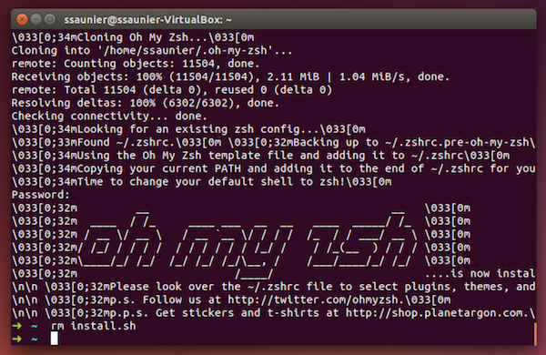

# Setup instructions

The following instructions will help you to get ready for [Le Wagon](http://www.lewagon.org) fullstack bootcamp:

- Grab a text editor, where you'll spend your day and nights
- Install a package manager
- Pimp your Terminal
- Setup git and GitHub
- Install Ruby


## Sublime Text 3 - Your text editor - check

A text editor is one of the most important tools of a developer.
Follow these instructions in the Terminal:

```bash
sudo add-apt-repository ppa:webupd8team/sublime-text-3
sudo apt-get update
sudo apt-get install -y sublime-text-installer
```

Sublime Text is free without any time limitation but a popup will appear every ten saves to remind you there is a license to buy. You can hit `Esc` when this happens, but feel free to buy Sublime Text if you really like this one (there are alternatives).


## Git

Download `git`, the versioning program we'll use everyday to archive our code:

```
sudo add-apt-repository ppa:git-core/ppa
sudo apt-get update
sudo apt-get install -y git
```


## Oh-my-zsh - Fancy your Terminal - check


We will use the shell named `zsh` instead of `bash`, the default one.

```bash
sudo apt-get install -y zsh curl vim nodejs imagemagick jq
sh -c "$(curl -fsSL https://raw.githubusercontent.com/robbyrussell/oh-my-zsh/master/tools/install.sh)"
# it will ask for your session password
```

Be careful, those commands will ask you to type your password twice. At the end
your prompt should look like this:



If it doesn't, **ask a teacher**.

To make this change stick, restart your laptop (or virtual machine):

```bash
sudo shutdown -r 0
```


## Dotfiles (Standard configuration)

Hackers love to refine and polish their shell and tools. We will start with a great default configuration provided by [Le Wagon](http://github.com/atmosfeer/dotfiles-workshop), stored on GitHub. This configuration gives you a number of handy tools that will make your life as a coder easier. Just follow the instructions to get the setup, but down the line you will be able to customize the options and make them your very own.

Now copy/paste this line in your terminal.

```bash
cd ~ && mkdir code
cd ~/code && git clone https://github.com/atmosfeer/dotfiles-workshop.git
```

Run the `dotfiles` installer.

```bash
cd ~/code/dotfiles-workshop
zsh install.sh
```

### Sublime Text auto-configuration

Open a new terminal and type this:

```bash
stt
```

It will **open Sublime Text in the context of your current folder**. That's how we'll use it.

**Wait 1 minute** for additional packages to be automatically installed (New tabs with text will automatically open, containing documentation for each new package installed).

To check if plugins are installed, open the Command Palette (`⌘` + `⇧` + `P` on OSX, `Ctrl` + `⇧` + `P` on Linux), type in `Packlist` and then `Enter`, you should see a couple of packages installed (like [Emmet](http://emmet.io/)).

If you do not, please install all of them manually. The list is referenced [here](https://github.com/lewagon/dotfiles/blob/master/Package%20Control.sublime-settings).


## Installing Ruby (with [rbenv](https://github.com/sstephenson/rbenv))

First we need to clean up any previous Ruby installation you might have:

```bash
rvm implode && sudo rm -rf ~/.rvm
# If you got "zsh: command not found: rvm", carry on. It means `rvm` is not
# on your computer, that's what we want!

rm -rf ~/.rbenv
```

Then in the terminal, run:


`sudo apt-get install -y build-essential tklib zlib1g-dev libssl-dev libffi-dev libxml2 libxml2-dev libxslt1-dev libreadline-dev`
```bash
sudo apt-get clean
sudo mkdir -p /usr/local/opt && sudo chown `whoami`:`whoami` $_
git clone https://github.com/rbenv/rbenv.git /usr/local/opt/rbenv
```
`git clone https://github.com/rbenv/ruby-build.git /usr/local/opt/rbenv/plugins/ruby-build`
`exec zsh`

You should get a warning in the prompt, just **ignore** it from now (Ruby is not installed yet).


Now, you are ready to install the latest ruby version, and set it as the default version.

Run this command, it will **take a while (5-10 minutes)**

```bash
rbenv install 2.3.4
```

Once the ruby installation is done, run this command tell the system
to use the 2.3.4 version by default.

```bash
rbenv global 2.3.4
```

Then **restart** your Terminal (close it and reopen it).

```bash
ruby -v
```

You should see something starting with `ruby 2.3.4p`. If not, ask a teacher.

## Installing some gems

All, please run the following line:

```bash
gem install bundler
gem install rspec rubocop pry pry-byebug hub colored octokit
```

**Never** install a gem with `sudo gem install`! Even if you stumble upon a Stackoverflow answer
(or the Terminal) telling you to do so.

## Download the assignments for today's workshop

Now your computer is all set to begin coding with a real developer environment. All that's left to do is download today's assignments from our online Github repo. Run these two lines:

```bash
  cd ~/code
  git clone https://github.com/atmosfeer/lewagon-weekend-workshop.git
```

## Get started with challenges

Copy these two lines in the terminal to get started with the first challenge:

```bash
  cd ~/code/lewagon-workshop/lewagon-challenges/day-1-ruby-basics/01-My-First-Methods
  stt
```
